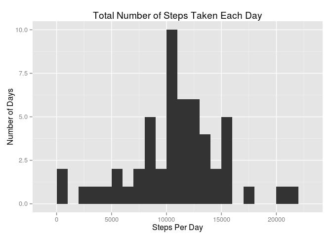
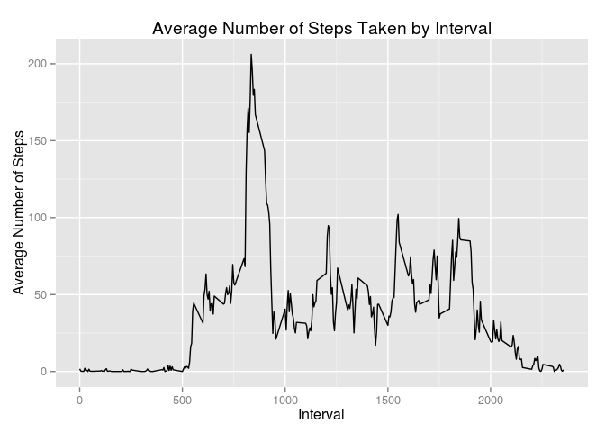
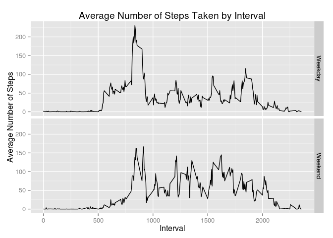

# Reproducible Research: Peer Assessment 1

## Loading and preprocessing the data
Load the packages required for the analysis. Load the data by reading the csv file which should be located in the working directory. Convert the date strings into POSIXct dates. Need POSIXct instead of the default result of strptime (POSIXlt) so that can group_by the date in subsequent steps.


```r
library(dplyr)
library(ggplot2)
activities <- read.csv("./activity.csv")
activities$date <- as.POSIXct(strptime(activities$date, "%Y-%m-%d"))
```

## What is mean total number of steps taken per day?
Use dplyr and ggplot2 packages to group and summarize data as well as plot the histogram. Remove NAs from the dataset. Select a binwidth for the plot (1000) that shows a good distribution of the number of steps taken in a day. Using the group_by function in dplyr removes the dates/factors that don't have any data. Therefore, my histogram is for the 53 days that have some data, not all 61 days in the dataset.


```r
df <- activities %>% na.omit() %>% group_by(date) %>% summarise(nsteps = sum(steps))

ggplot(df, aes(nsteps)) + geom_histogram(binwidth = 1000) + 
  labs(title = "Total Number of Steps Taken Each Day", x = "Steps Per Day", y = "Number of Days")
```

 

```r
# calculate the mean and median total number of steps taken per day
mean(df$nsteps)
```

```
## [1] 10766.19
```

```r
median(df$nsteps)
```

```
## [1] 10765
```


## What is the average daily activity pattern?
The following plot shows the average number of steps in each interval.

```r
df <- activities %>% na.omit() %>% group_by(interval) %>% summarise(avgsteps = mean(steps))

ggplot(df, aes(x = interval, y = avgsteps)) + geom_line() +
    labs(title = "Average Number of Steps Taken by Interval", x = "Interval", y = "Average Number of Steps")
```

 

```r
# interval with most steps on average
df$interval[df$avgsteps == max(df$avgsteps)]
```

```
## [1] 835
```

## Imputing missing values
There are a number of cases in the dataset with NA values.

```r
# number of cases with NA values
sum(is.na(activities$steps))
```

```
## [1] 2304
```

Fill in the missing values with the average for that interval over all the days.

```r
# join activities with average steps by interval
imputedata <- left_join(x = activities, y = df, by = "interval")

# create a function to fill in missing values
replaceNA <- function(steps, avgsteps) {
    if (is.na(steps)) {
        avgsteps
    } else {
        steps
    }
}

imputedata$newsteps <- mapply(replaceNA, imputedata$steps, imputedata$avgsteps)

df <- imputedata %>% group_by(date) %>% summarise(nsteps = sum(newsteps))

ggplot(df, aes(nsteps)) + geom_histogram(binwidth = 1000) + 
  labs(title = "Total Number of Steps Taken Each Day", x = "Steps Per Day", y = "Number of Days")
```

 

```r
# calculate the new mean and median total number of steps taken per day
mean(df$nsteps)
```

```
## [1] 10766.19
```

```r
median(df$nsteps)
```

```
## [1] 10766.19
```
Because my original graph did not include the days for which there was no data, the graph of the imputed data looks very similar to the original except that it has a much higher peak at the mean/median value. This is because the days that were left out originally are now assumed to have had the average number of steps. Imputing the data strengthens the mean and makes the meadiam = mean.


## Are there differences in activity patterns between weekdays and weekends?
There is a difference in the average number of steps taken depending on whether it is a weekday or weekend. The number of steps increases earlier in the day on weekdays as people are more likely to wake up earlier on weekdays. The activity level is higher during the middle of the day on weekends since people are more likely to be doing something besides sitting at work like they do on weekdays.


```r
# create a new factor variable for weekday/weekend
imputedata$weekday <- weekdays(imputedata$date)

# create a function to determine if day is a weekday or weekend
isWeekday <- function(wd) {
    if (wd %in% c("Saturday", "Sunday")) {
        dt <- "Weekend"
    } else {
        dt <- "Weekday"
    }
    dt
}

# determine type of day
imputedata$dayType <- as.factor(sapply(imputedata$weekday, isWeekday))

# group by interval and day type, calculate the average number of steps
df <- imputedata %>% group_by(interval, dayType) %>% summarise(avgsteps = mean(newsteps))

# plot
ggplot(df, aes(x = interval, y = avgsteps)) + geom_line() +
    labs(title = "Average Number of Steps Taken by Interval", x = "Interval", y = "Average Number of Steps") + 
    facet_grid(dayType ~ .)
```

 
